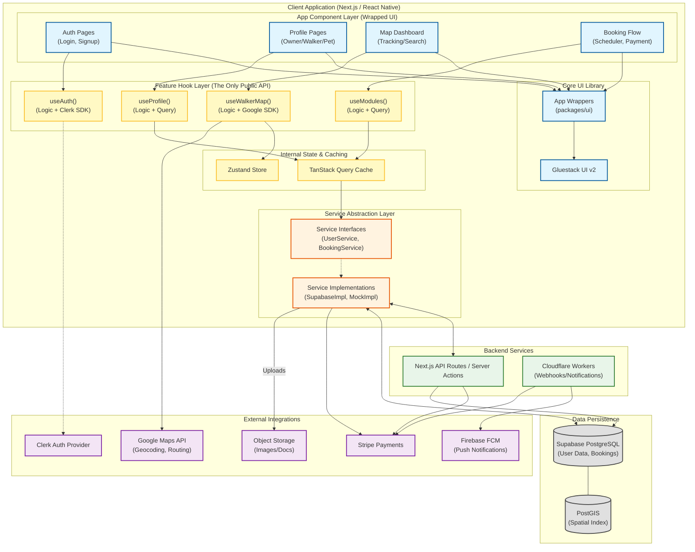

# System Component Diagram

This diagram illustrates the high-level components of the Dog Dash application, emphasizing the **Feature Hook** architecture where the UI Layer is strictly decoupled from backend services and business logic.

## Architecture Usage Rules

### 1. The Strict Interface Rule
*   **Components** (UI Layer) may **ONLY** import from the **Feature Hook Layer**.
*   Components must **NEVER** import:
    *   `TanStack Query` directly (useQuery).
    *   `Zustand` stores directly.
    *   `Supabase` or `Clerk` SDKs directly.
    *   `Service` classes.

### 2. Feature Hooks Contain Logic
*   Hooks are not just pass-throughs. They contain the **Business Logic** (e.g., "If booking is confirmed, start polling location").
*   They orchestrate multiple sources (e.g., Auth + Database + Maps).

### 3. Services are Dumb
*   Services only fetch/mutate data. They do not know about React state or UI logic.
